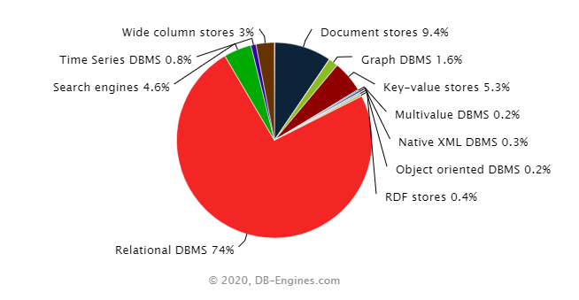

## Variedade

As fontes de dados disponíveis são o ponto de partida de qualquer projeto de dados e, infelizmente, para o profissional de dados, elas podem ser tão variadas quanto complexas.

Há milhares de fontes de dados possíveis, desde bancos de dados relacionais com uma estrutura bem definida até textos escaneados, imagens, áudios etc.  Cada fonte de dados possui seu próprio formato de armazenamento dos dados e metadados, isto é, informações adicionais que facilitam a leitura e o processamento dos dados que essa fonte armazena. 

Algumas fontes de dados, como bancos de dados relacionais, por exemplo, utilizam schemas e índices para (1) garantir que os dados ali inseridos sigam algumas regras pré-definidas, e (2) acelerar o desempenho das consultas a esses dados. Outras fontes de dados são menos rígidas quanto ao formato dos dados armazenados e podem ser chamadas de schemaless (do inglês, sem esquema). Essas fontes também podem utilizar índices para acelerar as consultas.

Cerca de 80% dos dados gerados e armazenados pelas empresas se enquadram no que chamamos de dados não estruturados, como vídeos, áudios, textos etc. No entanto, como podemos ver no gráfico abaixo, do comparativo da DB-Engines, os bancos de dados relacionais (que armazenam principalmente dados estruturados) ainda são os mais populares por uma larga margem. Por quê?

Gráfico XX: Comparativo da DB-Engines. Fonte: [DB-engines](https://db-engines.com/en/ranking_categories)

O grande motivo é que os bancos relacionais armazenam dados já prontos para serem analisados e inseridos em um relatório. Grande parte das empresas ainda não possui uma infraestrutura de dados sequer para analisar os dados já estruturados, de modo que dados que necessitam de maior esforço para extrair “o joio do trigo” ainda estão em segundo plano.