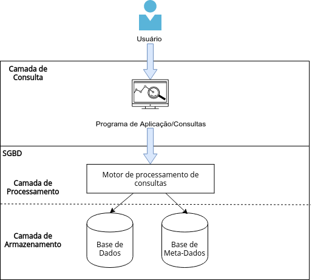

(target_header)=
# Capítulo 4 - Bancos de dados

Um sistema de gerenciamento de banco de dados  (SGBD)  ou simplesmente, banco de dados, é um conjunto de programas de software que permite aos usuários criar, editar, atualizar, armazenar e recuperar dados em tabelas de banco de dados. Dados em um banco de dados podem ser acrescentados, apagados, alterados, classificados usando um  SGBD (Gomes, 2020).  

De forma simplificada, um SGBD deve conter um programa de consultas que permite a um usuário humano ou máquina interagir com o banco de dados. Essas consultas são processadas por um Motor de Processamento de Consultas na chamada Camada de Processamento. Esse programa é então responsável por traduzir a consulta feita em alguma linguagem específica para um processo de mapear e retornar as informações requisitadas de onde elas estão fisicamente armazenadas no banco de dados.

[^mattoso]: Marta Mattoso. Introdução a Bancos de Dados. Disponível em: https://www.cos.ufrj.br/~marta/BdRel.pdf.